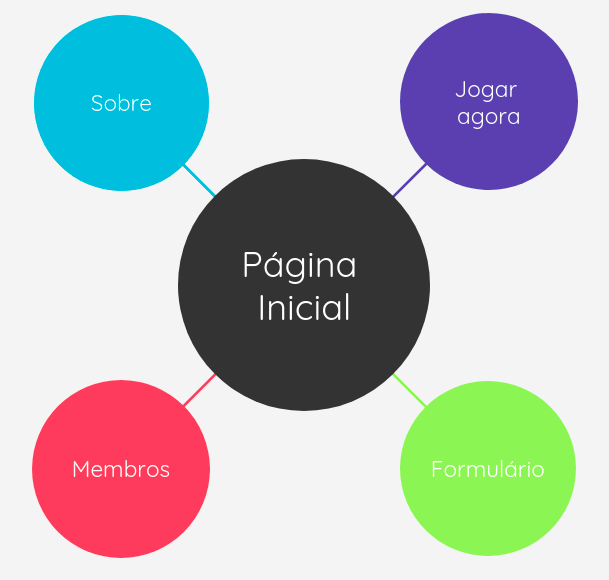
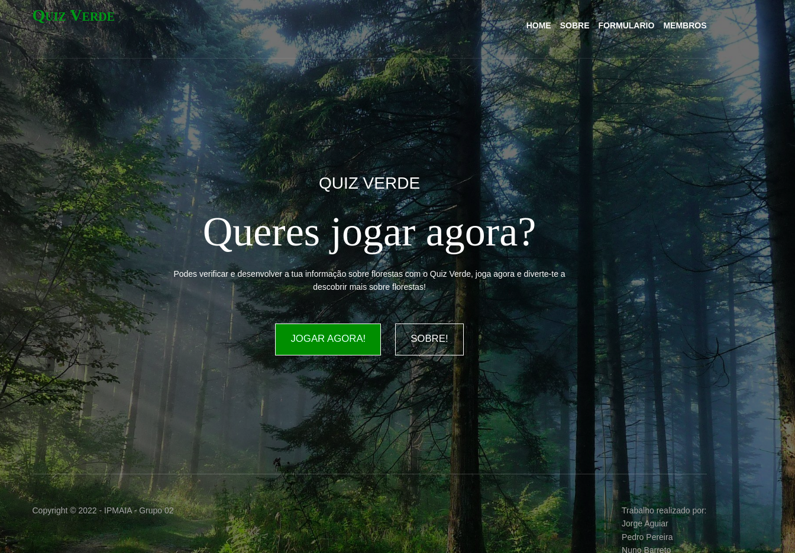
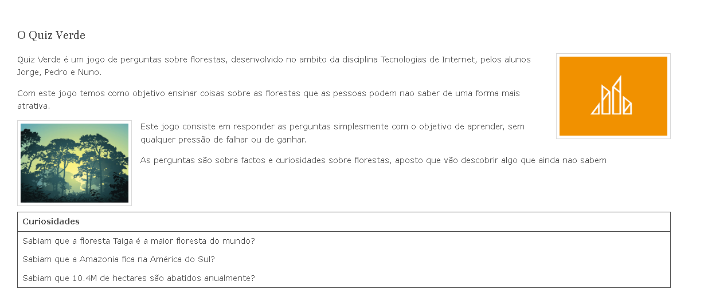
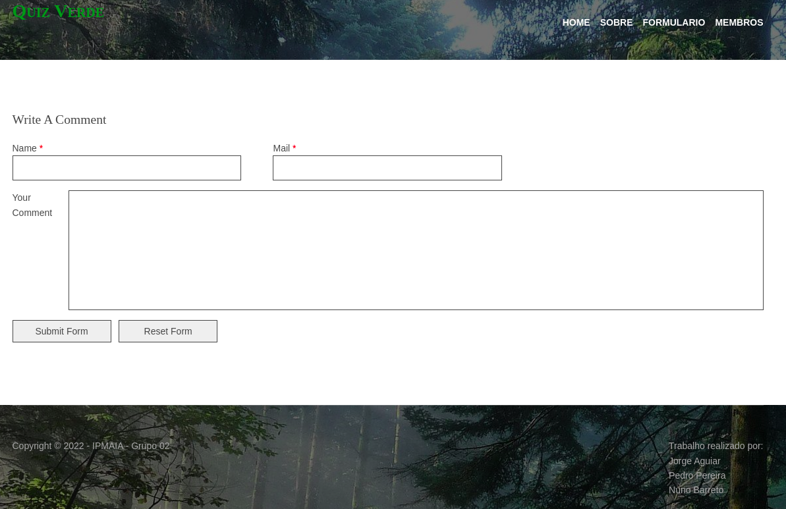
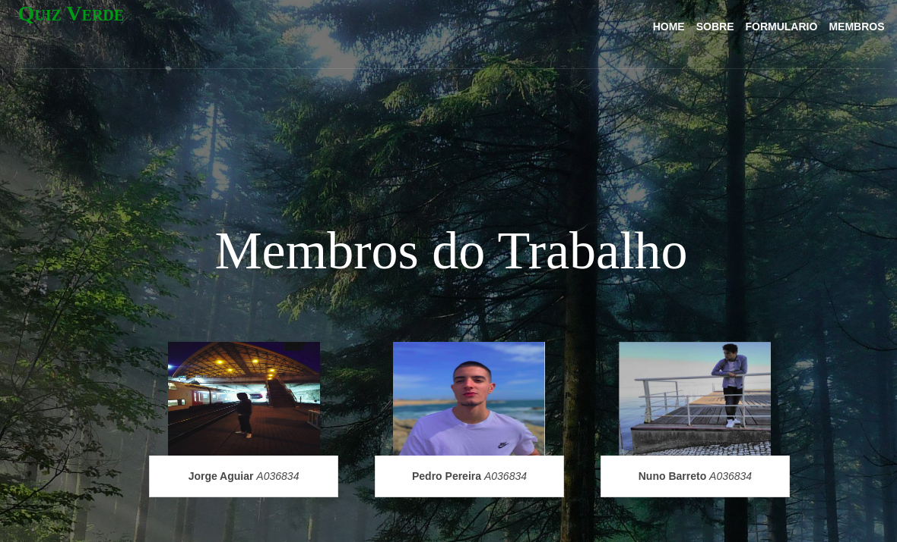
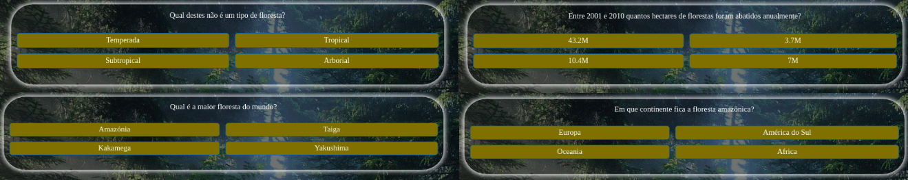
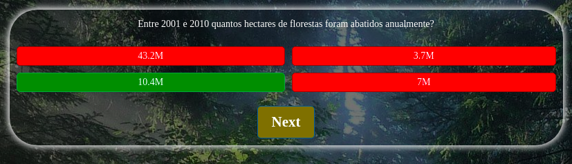

# Relatorio do trabalho prático de Tecnologias de Internet

# Quiz Verde

# Apresentação do projeto

 O nosso grupo para o trabalho de Tecnologias de Internet, desenvolveu um quiz sobre Florestas, o objetivo passou por ensinar de forma interativa o cuidado a ter nas florestas, as diversas florestas espalhadas pelo mundo, as diversas espécies que as habitam etc...

     Decidimos fazer este quiz, porque achamos ser uma forma interessante, interativa e engraçada de aprender, e simplesmente para não fazermos apenas um site de exposição decidimos fazer um quiz.

     O objetivo do quiz em si é mesmo dar a conhecer as florestas que existem, os problemas que elas sofrem e os cuidados a ter. Isto feito num formato de jogo com pontuação pode ser mais dinâmico e gerar mais interesse entre as pessoas por causa da competição.

    A nossa página inicial contem uma breve introdução sobre o quiz, temos tambem uma página com um pequeno formulário para as pessoas daram a sua opinião sobre o quiz, uma página com alguma informação sobre os membros do trabalho, temos uma página sobre algumas informações do quiz e de curiosidades para a preparação do mesmo.

     O nosso principal objetivo no desenvolvimento deste projeto prático passou essencialmente por mostrar que somos capazes de concluir com sucesso uma situação de trabalho em grupo, aplicando os conhecimentos adquiridos, auto-aprendizagem, pesquisa e demonstração das competências adquiridas ao longo do decorrer do semestre da cadeira Tecnologias Internet.

# Interface com o utilizador

<h2>Site map

  

<h2>Apresentação do resultado final

<h2>Página Inicial

  

<h2>Sobre

  

<h2>Formulario

  

<h2>Membros

  

<h2>Jogar Agora - Quiz
  

Os utilizadores respondem a pergutas sobre o tema florestas.

Quando o utilizador responde a uma pergunta a opção correta aparece a verde e as erradas em vermelho

# Produto
Quiz Verde é um jogo de perguntas sobre florestas, desenvolvido no âmbito da disciplina Tecnologias de Internet. Com este jogo temos como objetivo ensinar de uma forma mais atrativa sobre o tópico florestas .

## Tecnologias

Para este trabalho foram usada as seguintes tecnologias
* XML
* HTML5
* CSS
* Javascript
* Xampp

## Frameworks e Libraries

Para este trabalho usamos as seguintes Frameworks e Libraries
* Bootstrap
* JQuery

<h3>JQuery</h3>

 JQuery é uma biblioteca JavaScript. O objetivo do JQuery é tornar muito mais fácil usar JavaScript num site. JQuery leva muitas tarefas comuns que exigem muitas linhas de código JavaScript para serem realizadas e as envolve em métodos que se pode chamar com uma única linha de código. JQuery também simplifica muitas coisas complicadas do JavaScript, como chamadas AJAX e manipulação de DOM.  

Exitem muitas outras bibliotecas JavaScript por aí, mas JQuery é provavelmente a mais popular e também a mais extensível.

No nosso caso, a necessidade de utilizar JQuery se deu pelo fato de querermos utilizar outras bibliotecas que utilizam JQuery como base para seu funcionamento.

<h3>Bootstrap</h3>

 O Bootstrap é o framework HTML, CSS e JavaScript mais popular para o desenvolvimento de um site responsivo e amigável para dispositivos móveis e é totalmente gratuito para download e uso. É um framework front-end usado para um desenvolvimento web mais fácil e rápido e inclui modelos de design baseados em HTML e CSS para tipografia, formulários, botões, tabelas, navegação, modais, carrosséis de imagens e muitos outros com possibilidade de ser usado com plug-in JavaScript. ins e ainda facilita a criação de designs responsivos.

## Instalação

Para instalar o nosso projeto na máquina, deve instalar o XAMPP e executá-lo, após isso basta executar o serviço Apache depois disso, deve colocar nossa pasta do site no seguinte caminho "C:\xampp\htdocs".
Depois de concluir estes passos poderá abrir o nosso projeto que deverá funcionar corretamente.

## Uso

O nosso site foi feito de uma forma para que o utilizador consiga usar o site de uma forma simples e facil de usar, com botões e navegações para acesso rápido às páginas.

# Discussão

## As nossas justificações e opções tomadas na execução do trabalho

A plataforma Github foi utilizada para o desenvolvimento de projetos que foram solicitados pelo professor por se tratar de uma plataforma online onde permite a criação de repositórios bem como hospedagem de projetos, colaboração com software livre, entre outros. O GitHub armazena todos esses dados em uma nuvem e existe a possibilidade de acessar apenas com acesso à internet. Também é bastante prático, pois facilita o controlo de versões de um software ou aplicativo e, para os profissionais de tecnologia, as vantagens de utilizar o GitHub são inúmeras.

Com a necessidade de trabalhar em grupo usamos o visual studio code, além deste já ser familiar por ambos os membros do grupo, o visual studio permite que 2 ou mais membros estejam a trabalhar no mesmo projeto ao vivo a partir de um plug-in, em que permite que quando uma pessoa fizer uma alteração, a outra receba a nova atualização em tempo real. Decidimos usar o github porque o professor aconselhou o uso do mesmo, o mesmo aplica-se para o Visual Studio, foi muito fácil trabalhar no Visual Studio, pois já tínhamos 
experiência nele.

Decidimos recorrer ao auxilio das bibliotecas usadas pois nos anos anteriores já fomos familiarizados com elas, e assim o desenvolvimento do nosso trabalho foi mais fácil.

Desenvolvemos uma interface gráfica simples e dinâmica com a ajuda do bootstrap e as suas frameworks, tivemos facilidade em moldar o css à face daquilo que precisávamos devido à nossa experiência dos anos anteriores.

Usamos também o servidor de apache (Xampp) para o alojamento local do nosso site, necessitamos de usar este servidor pois precisamos de carregar dados para uma tabela através de um ficheiro XML.

Para o desenvolvimento do quiz usámos também matérias aprendidas nos anos anteriores como a utilização de javascript, este trabalho foi bom também para recordar este tipo de tecnologias que não usávamos tão recorrentemente.

Uma das maiores dificuldades neste trabalho foi a nossa falta de organização e gestão pois também tinhamos vários trabalhos de outras cadeiras e foi este o principal ponto para o trabalho não estar tão desenvolvido como deveria estar.

## Tarefas para cada elemento

O nosso grupo baseou-se num trabalho cooperativo entre todos os elementos, sendo recorrente o uso do discord para fácil discussão e resolução dos temas propostos.

# Apresentação

[Apresantação do Projeto](https://www.canva.com/design/DAE1ib84mfE/So2R1C3R4BnycRZ9wxfltw/view?utm_content=DAE1ib84mfE&utm_campaign=designshare&utm_medium=link&utm_source=sharebutton)

# Membros
Este trabalho foi realizado por:   
[@Nuno Barreto](https://github.com/Nunobps01)
  

[@Pedro Pereira](https://github.com/pedropereira06)
  

[@Jorge Aguiar](https://github.com/1jmaguiar)